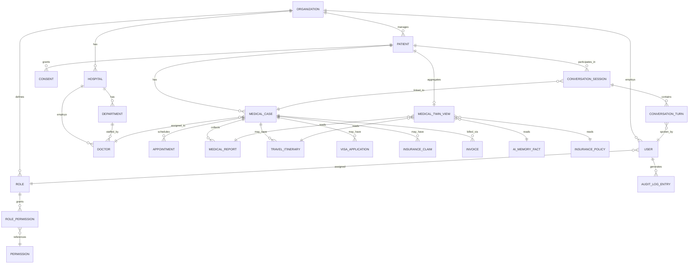

# Data Architecture

PostgreSQL. SQLAlchemy 2.0 models + Alembic migrations. Every tenant-scoped table has `org_id`
(FK to `organizations.id`) and Row-Level Security enabled — see [ARCHITECTURE.md](ARCHITECTURE.md#5-multi-tenancy).

## Core ERD (entities, not full column lists)



## Table notes by domain

**Identity / tenancy**
- `organizations` — branding (logo_url, theme), domain, subscription_tier, ai_config (jsonb)
- `users` — org_id, email, mfa_secret, status
- `roles`, `permissions`, `role_permissions` — DB-driven RBAC (see [RBAC.md](RBAC.md))

**Care delivery**
- `hospitals`, `departments`, `doctors` — org_id scoped
- `patients` — org_id scoped, PII columns encrypted at rest
- `medical_cases` — the spine of the patient journey; has a `stage` enum matching
  [WORKFLOWS.md](WORKFLOWS.md) (inquiry → long_term_care)
- `appointments`, `medical_reports`, `medical_documents`

**Conversation / AI**
- `conversation_sessions` — org_id, medical_case_id (nullable for ad-hoc), mode (voice/text/video),
  started_at/ended_at
- `conversation_turns` — session_id, speaker_user_id, speaker_role, source_lang, target_lang,
  source_text, translated_text, detected_emotion, created_at
- `ai_memory_facts` — patient_id, fact (jsonb), source_turn_id, consent_scope — this is what makes
  "patient mentioned bypass surgery 6 years ago" retrievable later, gated by `consents`
- `consents` — patient_id, scope, granted_at, revoked_at

**AI memory (see [AI_ARCHITECTURE.md](AI_ARCHITECTURE.md#memory-architecture))**
- `ai_memory_facts` — patient_id, org_id, scope (`preference`|`language`|`medical_history`|...),
  fact (jsonb), source_turn_id, consent_id (FK), created_at. One table for all consent-gated patient
  memory types — a `scope` column, not a table per memory type, because every type shares the same
  consent-check/read/write shape and a new memory type should not require a migration.
- `consents` — patient_id, scope, granted_at, revoked_at. Checked by `ai_memory.service.recall()`
  before any `ai_memory_facts` row is returned; revoked consent must make prior facts unreadable
  immediately, not just block new writes.
- Session memory is **not** a table — it lives in Redis, keyed by `conversation_session.id`, TTL'd
  to the session, because it's working memory, not a record that needs to survive a restart.
- Hospital/Doctor/Organization/Knowledge/Workflow memory are not separate tables either — they're
  read paths over `hospitals`/`doctors`/`organizations.ai_config`/`knowledge_base`/
  `medical_cases.stage` (history via audit log). Only patient-facing, consent-sensitive memory gets
  its own table.

**Medical Twin** — not a stored table, a read-time aggregate. `medical_twin.service.get_twin()`
joins `patients` + `medical_cases` + `medical_reports` + `ai_memory_facts` (scope=medical_history/
preference/language) + `travel_itineraries` + `insurance_policies`, after a single consent check.
See [AI_ARCHITECTURE.md](AI_ARCHITECTURE.md#medical-twin) for why this is deliberately not a
denormalized table.

**Journey / coordination**
- `travel_itineraries`, `hotel_bookings`, `airport_pickups`, `visa_applications`,
  `insurance_policies`, `insurance_claims`

**Commercial**
- `invoices`, `payments`, `subscriptions`

**Cross-cutting**
- `audit_log_entries` — append-only (DB grant: INSERT only, no UPDATE/DELETE for any app role),
  columns: org_id, actor_user_id, action, entity_type, entity_id, metadata (jsonb), created_at

## Multi-tenant enforcement (concrete)

```sql
-- every tenant table, e.g.:
ALTER TABLE patients ENABLE ROW LEVEL SECURITY;
CREATE POLICY tenant_isolation ON patients
  USING (org_id = current_setting('app.current_org_id')::uuid);
```

The API sets `app.current_org_id` at the start of each request (in the tenant-context middleware)
from the authenticated user's org — application code never needs to remember to filter by org_id
for the policy to hold; it's a backstop, not the primary mechanism (see ARCHITECTURE.md §5).

## Migration discipline

Alembic, one migration per PR, autogenerate + manual review (autogenerate misses RLS policies and
check constraints). No destructive migration (drop column/table) ships without a backward-compatible
deprecation step first, given this will carry live patient/clinical data once in production.
